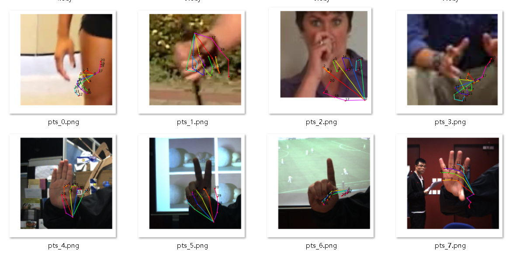
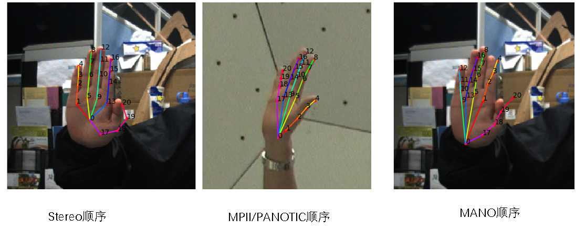
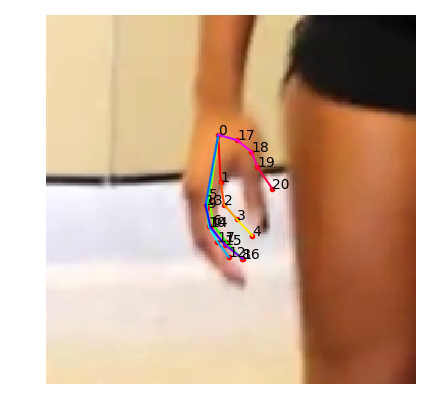
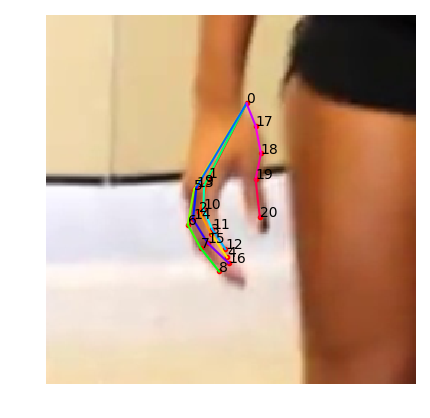
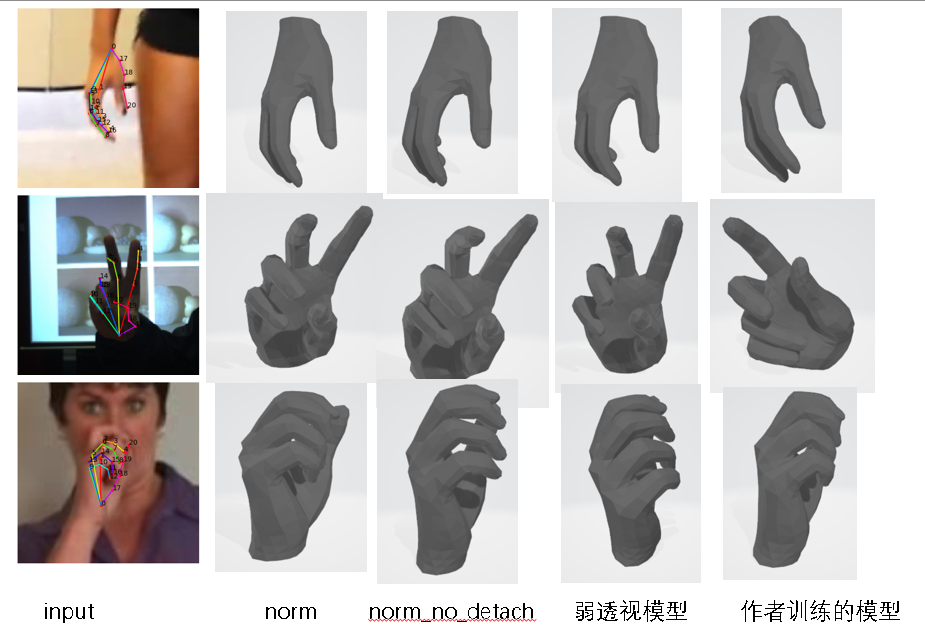
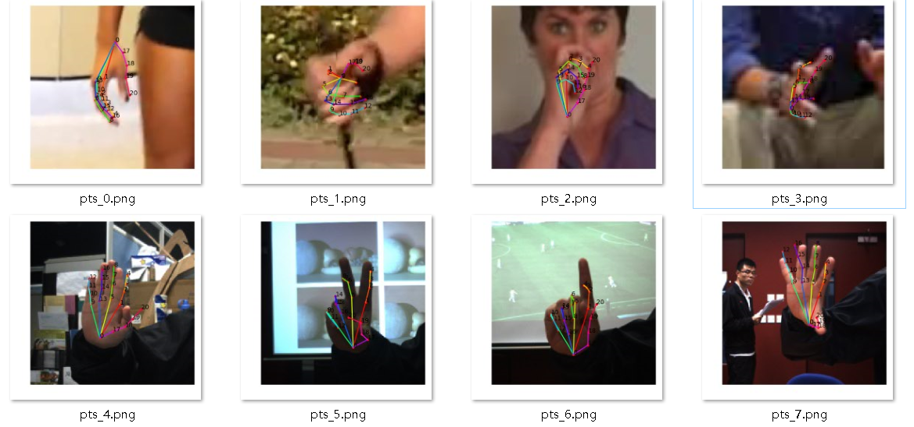

# 			     3D-hand

**Unofficial pytorch code** for [3D Hand Shape and Pose from Images in the Wild](https://arxiv.org/abs/1902.03451). 

According to the paper and [the official open-source code](https://github.com/boukhayma/3dhand) (the official code only includes network part), this implementation can reproduce the visual results, which are reported in the paper.

Another more detailed README is written in Chinese, which is in Folder "chineseReadme". If I have time, I will translate it into English.


## 0. overview

My work can be divided into the following parts:

- pretrain 
- train


requirements:

- Python 2.7
- PyTorch 0.3
- [MANO](http://mano.is.tue.mpg.de/)


Note:

- All 2d coordinates are converted into the form that the first number represents width and the second represents height.


---

## 1.pretrain

### 1.1 generate dataset

create a synthetic dataset of paired hand images with their groundtruth camera and hand parameters.

The involved scrpit code is in the folder 3dhand/scripts.

```python
# step 1
python2 create_colored_meshes.py
# step 2
python2 create_synthetic_data.py
```

Finally, we generate a synthetic dataset that includes 1w8 trainset and 2k testset.


### 1.2 pretrain

```
python2 --config configs/pretrain_model0.yaml 
```


### 1.3 pretrain result




------


##  2.train

### 2.1 generate dataset

run the following script, which will process panoptic， MPII+NZSL and stereo into a dataset that we use to train the network.

```
python2 scripts/make_dataset.py
```


**Note that 21 keypoints order are different in three datasets and MANO model**(see below image). I adopt the MANO's order. The converting code is in dataset.py/HandTrainSet/\__getitem__ and sort




### 2.2 generate mask

```
python2 scripts/segment.py
```


### 2.3 train

We have three choices for calculating 3d Loss. 

```
# calculate 3d Loss with weak perspective model
python2 train.py --config configs/train_model0_3d.yaml 

# calculate 3d Loss with normalizaiton
python2 train.py --config configs/train_model0_3d_norm.yaml 

# calculate 3d Loss with normalizaiton with derivative of mean and variance 
python2 train.py --config configs/train_model0_3d_norm_no_detach.yaml
```


**Note**:

1. During pretrain, it's better to set the batch size to **32 or 64.** While in train, **8 or 16** is recommended.

2. The paper's author contend that **the novel mask loss** will accelerate training. However,  according to my experiments, if we still keep the mask loss's weight to 100 at the end of training, it will result that the generated 2d keypoints obvious are smaller that the groundturth (see below image). That is to say the loss can't convergence.

   

   So I recommend to reduce the weight to 1 or 10 at the end of training. The below image is the result.

   


### 2.4 result

I train the model in three choices respectively. As a result, all three methods can lead to a model that have similar visual output with the model trained by author.


**3d mesh**



**2d keypoints**




## 3. other scripts

convert3d annotation in  stereo dataset measured in millimeters into 2d annotation measured into pixel.

```
python2 scripts/prepare_dataset/mm2px.py
```

recognize hand box and crop

```
python2 scripts/crop.py
```

test pretrain model

```
python2 test_pretrain_model.py
```

see model's visual result

```
python2 tester.py
```

generate heatmap

```
python2 scripts/heat_map.py
```


Author: Yue Yang

